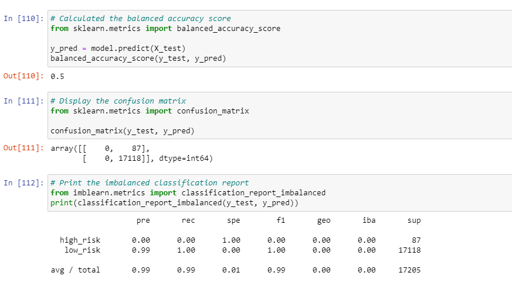
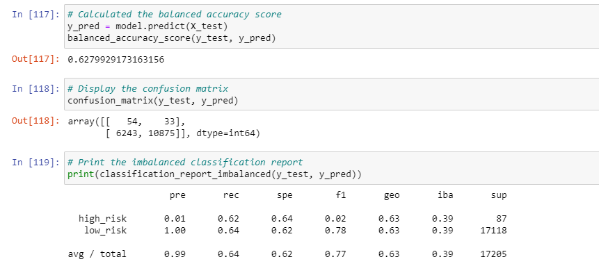
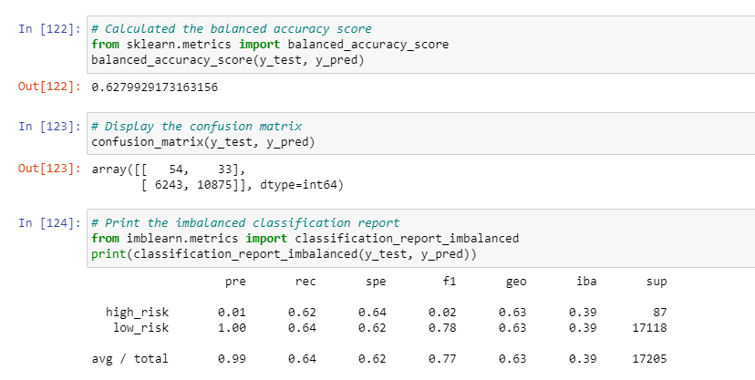
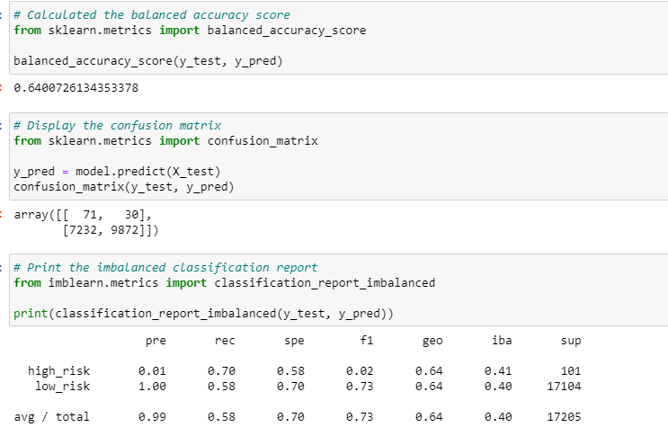
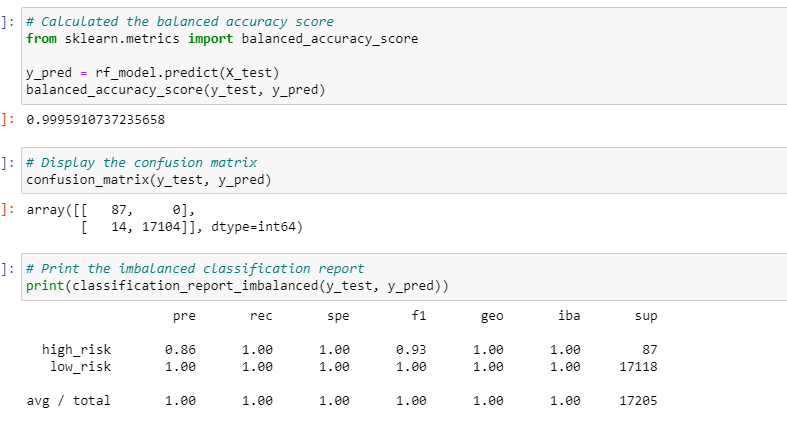
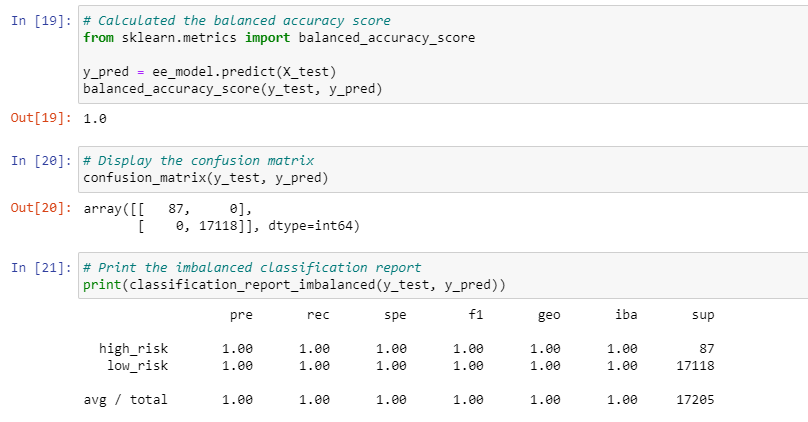

# Credit_Risk_Analysis

## Overview of the analysis: 
The purpose of this analysis was to evaluate the performance of different models to predict risk.

## Results:  describe the balanced accuracy scores and the precision and recall scores of all six machine learning models. Use screenshots of your outputs to support your results.
  1. Oversampling: The accuracy score is .5, the precision is .99 and the recall score is .99.
  
  2. Smote Oversampling:  The accuracy score is .62, the precision is .99 and the recall score is .64.
  
  3. Undersampling: The accuracy score is .63, the precision is .99 and the recall score is .64.
  
  4. Combination (over & under sampling):  The accuracy score is .64, the precision is .99 and the recall score is .58.
   
  5. Balanced random forest classifier:  The accuracy score is 1  , the precision is 1 and the recall score is .99.
  
  6. Easy ensemble ADABoost Classifier:  The accuracy score is 1, the precision is 1 and the recall score is 1.
  

Summary: The easy ensemble ADABoost Classifier is the best model to use because the accuracy score, precision and recall scores are the highest. The oversampling model has the lowest accuracy score so it would not be the best model to use. 
